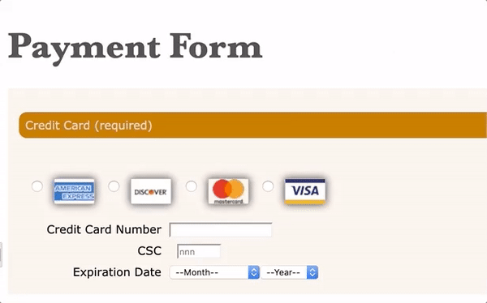

# t8-code-4

## Summary
You can use transitions and animations in web forms to draw your eyes to particular form elements or to highlight invalid form data. You've been given a website that uses a transition effect to highlight invalid credit card values; however, the transition effects and animation are not working. You will edit the style sheet of the page shown in *Figure 8-62* to fix the problem.



*Figure 8-62*

Do the following:

## Tasks
Open the file *code8-4.html* and *code8-4_debug.css* and in the comment section enter your **name** (First + Last) and the **date** (MM/DD/YYYY) into the ```Author:```
and ```Date:``` fields of each file.

Open the *code8-4.html* file and within the ```head``` section insert a ```link``` element that links the page to the *code8-4_debug.css* style sheet file.

Open the *code8-4.html* file. When the page opens, the ```h1``` heading should slide into the page from the left and the form should drop in from the top. Neither is happening. Open the *code8-4_debug.css* file and study the code that applies the animation effect to the ```form#payment``` object and the ```h1``` element. Fix any mistakes in the code that you find and verify that the opening of the page runs the drop-in and slight-right animations.

When the **Credit Card Number** box and the **CSC** box receive the focus, a transition effect should appear that slowly adds a glowing brown shadow around the boxes. The glowing brown shadow appears but without a transition effect. Return to the *code8-4_debug.css* file and study the code that applies a transition effect to both the ```input#cardBox``` and ```input#CSC``` objects, and the ```input#csc:invalid``` style. Correct any mistakes you find in the code. Verify that when the **Credit Card Number** and **CSC** boxes receive the focus a transition effect appears that adds the glowing brown shadow to the boxes.

A **3**-digit number should be entered in the **CSC** box. If something other than a **3** digit number is entered, the box should wiggle back and forth to indicate invalid data. That is not currently happening. Open the *code8-4_debug.css* file. Study the code that applies the transition effect to the ```input#csc``` object when invalid data is entered. Correct any mistakes in the code that you find. Verify that when you enter invalid data in the **CSC** box, the box wiggles back and forth to indicate that the data is not valid.

Open the website in the browser preview. Verify that when you enter invalid data in the CSC box, the box wiggles back and forth to indicate that the data is not valid.
