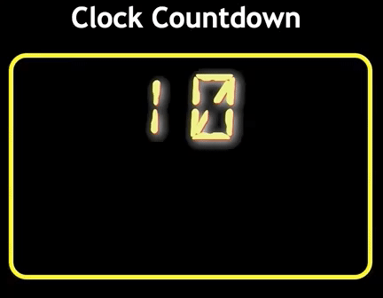

# t9-code-2



## Summary
*Figure 9-41*
shows a preview of a page containing a countdown clock that counts down from 10 seconds to zero. When zero is reached, the page will show the message "Time&rsquo;s Up".

Do the following:

## Tasks
Open the files*code9-2.html* and*countdown9-2.js* and in the comment section enter your **name** (First + Last) and the **date** (MM/DD/YYYY) into the ```Author:``` and ```Date:``` fields of each file.

Open the *code9-2.html* file and within the ```head``` section insert a ```script``` element connecting the page to the *countdown9-2.js* file. Add the ```defer``` attribute to the ```script``` element.

Open the *countdown9-2.js* file and directly below the initial comment section, declare the ```secsLeft``` variable, setting its initial value to **10**.

Create the ```countdown()``` function and within the function add the following:

1. Declare the ```secsString``` variable by calling the ```addLeadingZero()``` function using the ```secsLeft``` variable as the function value. The ```addLeadingZero()``` function is used to add leading zeroes to numeric values from **0** to **9**.

2. Change the text content of the document element with the ID **seconds** to the value of the ```secsString``` variable.

3. Run the ```checkCountdown()``` function to determine whether the end of the countdown has been reached.

4. Use the decrement operator to reduce the value of the ```secsLeft```
variable by **1**.

Create the ```stopCountdown()``` function to the stop the countdown when **0** is reached. Add the following commands to the function:

1. Change the text content of the document with the ID **Alert** 
to the text string **Time&rsquo;s Up**.

2. Use the ```clearInterval()``` method to the clear the repeating command with the **timeID** variable```clockID```.

3. Go back to the top of the file and directly after the command to declare the ```secsLeft``` variable insert a command using the ```setInterval()``` method to run the ```countdown()``` function every second. Store the time ID associated with the repeating command in the ```clockID``` variable

Open the website in the browser preview. Verify that the page shows a countdown from 10 down to 0 seconds and when 0 seconds is reached, the page shows the message "Time&rsquo;s Up".
